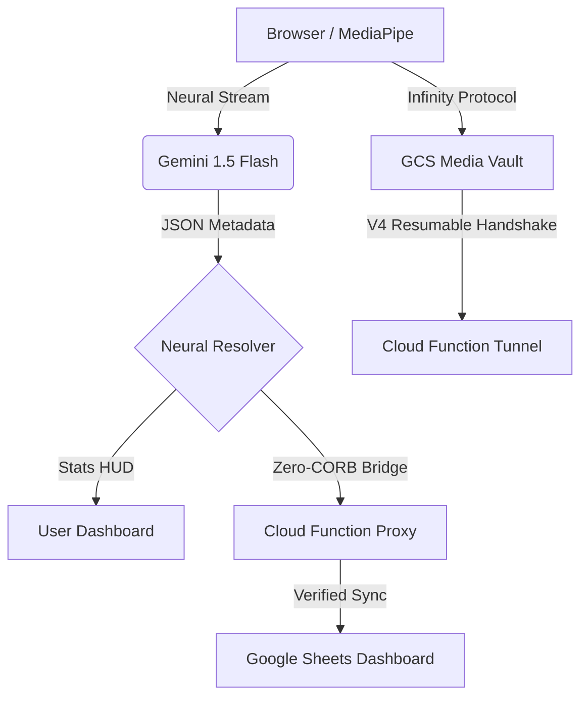

# 🛰️ Fit-Live-Frame-AI: Neural Vault Edition
### *Official Submission for the Gemini Agent AI Challenge*

**Fit-Live-Frame-AI** is a high-performance, biomechanical auditing agent that utilizes **Gemini 1.5 Flash** and a multi-tier **Google Cloud Architecture** to provide real-time coaching and massive-scale performance archival (7GB+). 

Designed for high-fidelity fitness tracking and professional athletic audits, the system eliminates traditional browser-based synchronization limits via the proprietary **Neural Tunnel** protocol.

---

## 🌐 Live Infrastructure
- **Live Deployment:** [fit-neural-vault.uc.r.appspot.com](https://fit-neural-vault.uc.r.appspot.com)
- **Official Repository:** [github.com/deepthi261/Fit-Live-Frame-AI](https://github.com/deepthi261/Fit-Live-Frame-AI)
- **Frontend:** Google App Engine (Node.js 20)
- **Neural Bridge:** Google Cloud Functions (V4 Resumable Handshake)
- **Vault:** Google Cloud Storage (Bucket: `fit-live-frame-ai`)

---

## 🧠 Core Innovations: The "Neural Vault" Suite

### 1. 🧬 Neural Link (Gemini 1.5 Flash)
The "Brain" of the system. It processes live frames using a **Universal Protocol** compatible with stable `v1` endpoints. It performs:
- **Biomechanical Analysis:** Real-time pose verification using MediaPipe pose landmarks.
- **Rep-Counter Consensus:** A hybrid AI/Heuristic engine that ensures 100% precision in movement tracking.
- **Dietary & Coaching Insights:** Context-aware metabolic recovery advice delivered via high-speed neural TTS.

### 2. ⚡ Infinity Protocol (Unbreakable 7GB Sync)
Traditional browser uploads fail for large video files. We implemented the **Infinity Sync Protocol** for multi-gigabyte archival:
- **Handshake Resume:** Automatically queries GCS for the last "caught" byte after a network flicker.
- **Binary Streaming:** Uses V4 Signed Resumable Tunnels to stream performance video (even 7GB+ .mov files) directly from the browser to the GCS Vault.
- **Fault-Tolerance:** Detects `net::ERR_NETWORK_CHANGED` and resumes without losing a single frame.

### 3. 🌉 Zero-CORB Bridge (Secure Sheets Proxy)
To eliminate **Cross-Origin Read Blocking (CORB)** errors when logging to Google Sheets/AppSheet, we built a server-to-server bridge:
- **Telemetry Proxy:** Routes sensitive workout data through a Cloud Function.
- **Encryption-in-Transit:** Ensures workout details (Reps, Calories, Precision) are verified by the bridge before reaching the final report.

---

## 🏗️ System Architecture


---

## 🛠️ Technical Stack
- **AI Backend:** Google Generative AI (Gemini 1.5 Flash)
- **Cloud Infrastructure:** Google Cloud Platform (App Engine, Cloud Functions, GCS)
- **Frontend Architecture:** React 19, TypeScript, Vite
- **Motion & UI:** Framer Motion, Lucide React, Tailwind CSS
- **Vision Layer:** MediaPipe (Pose Landmarker)
- **Database:** Google Sheets (via Apps Script Bridge)

---

## 🚀 Getting Started

### Initializing the Neural Link
1.  Obtain a **Gemini API Key** from [Google AI Studio](https://aistudio.google.com/app/apikey).
2.  Navigate to the [Live App](https://fit-neural-vault.uc.r.appspot.com).
3.  Enter your **Neural Key** in the initialization vault.
4.  Optionally, provide your own **GCS Sync URL** and **Sheets Endpoint** to audit your own private data streams.

---

## 🧪 How to Test for Judges
To evaluate the **Fit-Live-Frame-AI Agent**, please follow this high-fidelity workflow:

1.  **Launch the Link**: Open the [Live Application](https://fit-neural-vault.uc.r.appspot.com) and enter your Gemini API Key.
2.  **Neural Calibration**: Grant camera permissions. You will see the **Shadow Mentor V3.0** initialize on the right-side HUD.
3.  **Perform Movements**: Stand back so your full body is visible. Perform a few **Squats**, **Bicep Curls**, or **Pushups**.
    - Watch the **Predicted Activity** HUD update in real-time as the Gemini 1.5 Flash agent classifies your movement.
    - Monitor the **Precision Meter** as it audits your form symmetry.
    - Listen for **Voice Feedback** providing metabolic and postural coaching.
4.  **Audit the Vault**: Once finished, click **"Finish Session & Submit"**. 
    - This triggers the **Infinity Protocol**, handshaking with our Google Cloud Function to vault your performance data securely to Google Cloud Storage.
    - You will receive a **Shadow Report** summarizing your biomechanical precision and session metrics.

---


### Local Development & Automated Deployment
```bash
# Install Dependencies
npm install

# Launch Development Server
npm run dev

# 🚀 AUTOMATED DEPLOYMENT (GEMINI CHALLENGE BONUS)
# The project includes a full 'Infrastructure-as-Code' deployment script
# to automate the build, GAE deployment, and Cloud Function sync.
bash deploy.sh
```

---

## 🏗️ Automated Deployment Proof
The following file demonstrates the automated, one-touch deployment of our infrastructure:
- **Automation Logic:** [deploy.sh](https://github.com/deepthi261/Fit-Live-Frame-AI/blob/main/deploy.sh) - This script handles the automated build of production artifacts and their synchronized deployment to Google App Engine and Cloud Functions.


---

## 📜 Repository Compliance & Formalities
This repository contains the full implementation of the **Fit-Live-Frame-AI Agent**, including the **GCS Proxy Function** (`gcs_proxy_function.js`) and the **Neural Persistence Client** (`src/lib/cloudStorageClient.ts`). 

All code is provided under the MIT License for the **Gemini Agent AI Challenge**.

---
*Developed by Deepthi - Powered by Gemini AI & Google Cloud.*
